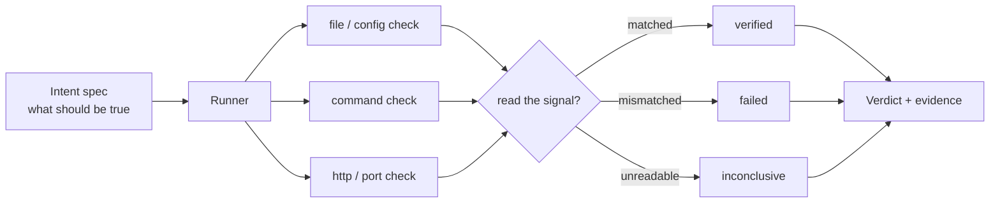

# Intent Verify

> **Declare desired state as intent; prove it with observable checks.**

[](https://github.com/qa-veritas)
[](https://github.com/qa-veritas)
[](https://github.com/qa-veritas/intent-verify/actions/workflows/ci.yml)

*A component of [**QA Veritas**](https://github.com/qa-veritas) — an exploration of how AI agents reason about, verify, and operate complex systems.*

---

## Problem

A change is not done when it is applied. It is done when an observable signal confirms it — and most automation skips that step. Worse, most "it passed" checks really mean "it didn't error," which is not the same as "it worked." And when a check *can't* read its signal (the host is unreachable, the command is missing), automation tends to quietly treat that as success. An agent operating on this basis reports victory it cannot substantiate. That is how you ship a regression with a green checkmark.

## Core Idea

Make verification a **first-class, declarative artifact**. You write *what should be true* — the index responds on its port, the process runs with the new config, the file contains the new route — and the tool turns each statement into an observable check, runs it, and returns a verdict with evidence. Crucially, the verdict is **three-valued**:

- **verified** — the signal was read and matched.
- **failed** — the signal was read and did *not* match.
- **inconclusive** — the signal could not be read. Reported honestly, never silently passed.

The third value is the whole point. You cannot conclude a change failed from a signal you couldn't read — and you certainly can't conclude it passed.

## Architecture Diagram



## Concepts

- **Intent over procedure** — declare the destination, not the keystrokes; intent survives refactors and environment drift that shatter step-by-step scripts.
- **Three-valued truth** — `verified / failed / inconclusive`; honesty about unreadable signals is what makes the green ones trustworthy.
- **Observable evidence** — a verdict carries *why*: the status read, the port state, the matched substring.
- **Symmetry with feasibility** — intent (forward: "make this true") is the mirror of [Resource Ledger](https://github.com/qa-veritas/resource-ledger)'s feasibility check (backward: "can this be true?"). One mechanism, two directions.

## Examples

An intent spec is a list of named checks — each a `kind`, a target, and what to `expect`:

```yaml
intent: "index node db-1 is serving with the new heap"
checks:
  - name: package identity
    kind: file_contains
    path: pyproject.toml
    contains: "intent-verify"

  - name: interpreter sane
    kind: command
    run: "python3 -c 'print(42)'"
    expect_stdout_contains: "42"

  # live signals degrade to inconclusive when unreachable — never a false pass
  - name: index responds
    kind: http_status
    url: "http://localhost:9200/_cluster/health"
    expect_status: 200
```

| kind | reads | verified when |
|------|-------|---------------|
| `file_exists` / `file_contains` | filesystem | path exists / substring present |
| `command` | a subprocess | exit 0 (and optional stdout match) |
| `http_status` | a URL | response status matches |
| `port_open` | a TCP connect | the port accepts a connection |

## Quick Start

```bash
pip install -e .          # or: python -m intentverify --help

python -m intentverify run --spec examples/intent.yaml
python -m intentverify run --spec examples/intent.yaml --inconclusive-is failed   # CI-strict
```

Python 3.10+. One dependency (`pyyaml`).

## Why It Matters

For **engineers**: "done" gets a definition. A change ships with the signal that proves it, and CI can be strict about the difference between *passed* and *didn't error*.

For **AI agents**: this is the **Action** half of the loop — the contract that lets an agent *close* a change instead of declaring victory. An agent that must produce a `verified` signal, and that reports `inconclusive` honestly, is one you can let operate unattended. Verification is the artifact that makes autonomy safe.

## Future Vision

- A `feasibility` pre-check block per intent, gating a change before it's attempted (mirrors Resource Ledger).
- Retry-with-timeout on observable state (wait for green) instead of a single sample — no fixed sleeps.
- A `diff` mode: snapshot before and after, verify only what was supposed to move.
- Pluggable check kinds via entry points.

---

## Part of QA Veritas

**QA Veritas** explores *AI-Native Verification Engineering* — practical patterns for a future where humans and AI agents operate complex systems together. Every component serves one loop:

**Memory → Reasoning → Verification → Action**

```
QA Veritas
├── Resource Ledger                    Memory       operational truth as a git tree
├── State Triage                       Reasoning    deterministic triage around an agent
├── LogLens                            Reasoning    code-aware evidence from logs
├── Intent Verify     ◀ you are here   Verification declarative intent → observable proof
├── Runbook Forge                      Runbooks     procedures derived from verified history
├── SkillPack                          Skills       progressive-disclosure agent capability
└── Future Agents                      Agents       narrow operators that compose the above
```

| Layer | Component |
|-------|-----------|
| Memory | [Resource Ledger](https://github.com/qa-veritas/resource-ledger) |
| Reasoning | [State Triage](https://github.com/qa-veritas/state-triage) · [LogLens](https://github.com/qa-veritas/loglens) |
| **Verification** | **Intent Verify** (this repo) |
| Runbooks | [Runbook Forge](https://github.com/qa-veritas/runbook-forge) |
| Skills | [SkillPack](https://github.com/qa-veritas/skillpack) |
| Writing | [Field notes & essays](https://github.com/qa-veritas/writing) |

Start at the [platform overview](https://github.com/qa-veritas). MIT licensed.
